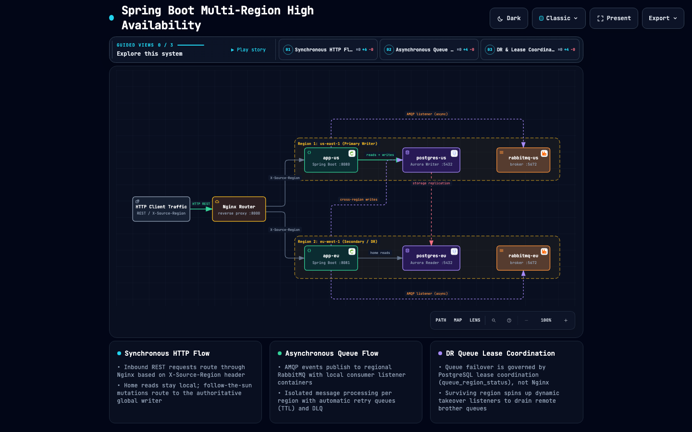
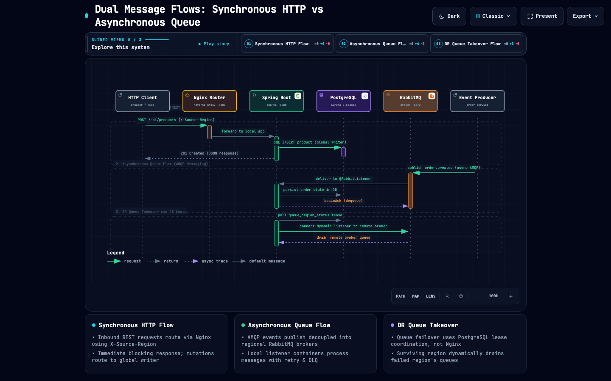
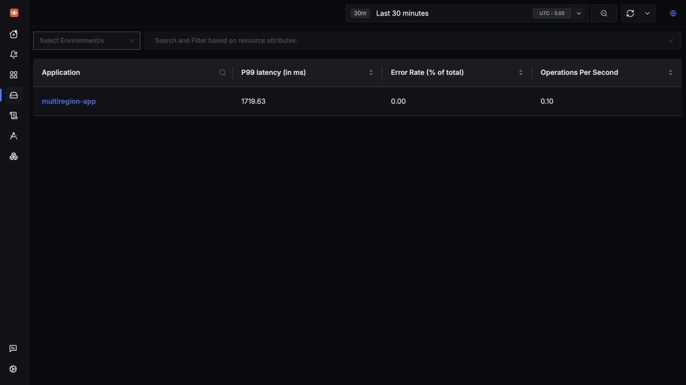
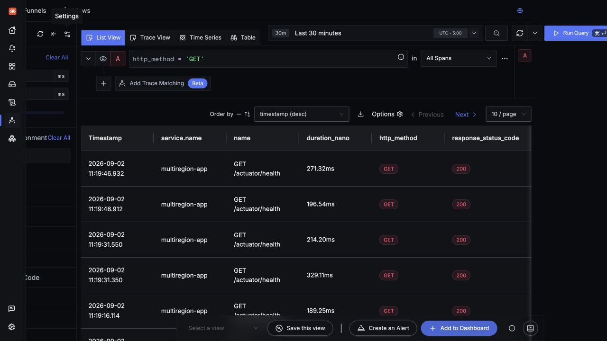
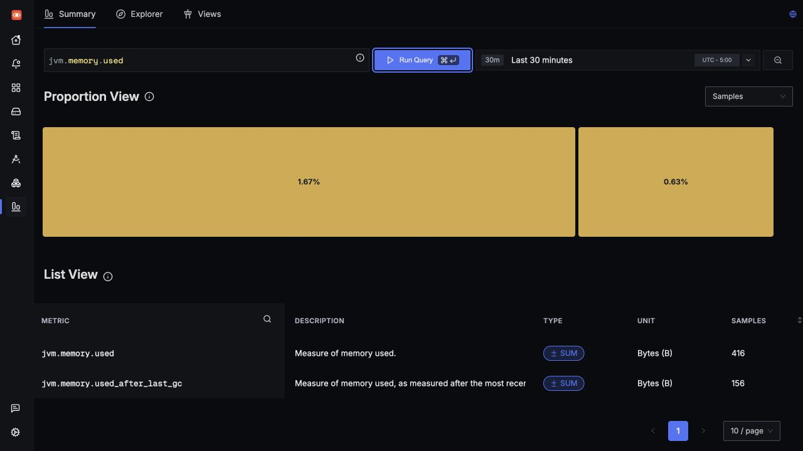

# Spring Boot Multi-Region High Availability

[](https://spring.io/projects/spring-boot)
[](https://jdk.java.net/26/)
[](docs/project-leyden-aot.md)
[](https://github.com/aws/aws-advanced-jdbc-wrapper)
[](https://www.postgresql.org/)
[](https://www.docker.com/)
[](https://tuannx.github.io/spring-boot-multi-region-ha/)
[](https://tuannx.github.io/spring-boot-multi-region-ha/flows.html)
[](https://tuannx.github.io/spring-boot-multi-region-ha/)

A Spring Boot application demonstrating multi-region high availability using the **AWS Advanced JDBC Wrapper** `failover2` plugin. This project simulates Aurora topology and control-plane state with local PostgreSQL instances, including bounded failover detection, runtime writer routing, nginx request routing, and region-aware health monitoring.

The repository also includes an independent
[`Cassandra multi-region case`](cases/cassandra/README.md) for workloads that
need active-active regional writes rather than Aurora's fenced single-writer
model.

<p align="center">
  <a href="https://tuannx.github.io/spring-boot-multi-region-ha/">
    <picture>
      <source media="(prefers-color-scheme: dark)" srcset="docs/assets/architecture-dark.png">
      <source media="(prefers-color-scheme: light)" srcset="docs/assets/architecture-light.png">
      
    </picture>
  </a>
  <br>
  <em>Figure 1: Multi-Region Runtime Architecture with Follow-the-Sun Writer & Home Reads. <a href="https://tuannx.github.io/spring-boot-multi-region-ha/">👉 Open Interactive Architecture Explorer</a> (powered by <a href="https://github.com/tt-a1i/archify">Archify</a>).</em>
</p>

<details>
<summary>Text-based Topology (ASCII)</summary>

```text
                         ┌─────────────────────────────────────────────┐
                         │           nginx-router (port 8000)          │
                         │    Routes requests to source/home region    │
                         └──────────┬──────────────────────┬───────────┘
                                    │                      │
                    ┌───────────────┘                      └───────────────┐
                    ▼                                                     ▼
        ┌───────────────────────────┐                        ┌───────────────────────────┐
        │      Region: us-east-1    │                        │      Region: eu-west-1    │
        │                           │                        │                           │
        │  ┌─────────────────────┐  │                        │  ┌─────────────────────┐  │
        │  │     app-us:8080     │  │                        │  │     app-eu:8080     │  │
        │  │  reads ──► home DB  │  │                        │  │  reads ──► home DB  │  │
        │  │  writes ─► writer   │──┼──────────────┐  ┌──────┼──│  writes ─► writer   │  │
        │  └──────────┬──────────┘  │              │  │      │  └──────────┬──────────┘  │
        │             │ reads       │              │  │      │             │ reads       │
        │  ┌──────────▼──────────┐  │              │  │      │  ┌──────────▼──────────┐  │
        │  │  postgres-us:5432   │◄─┼─ writer in US┘  │      │  │  postgres-eu:5432   │  │
        │  │ US home read target │  │                 │      │  │ EU home read target │  │
        │  └─────────────────────┘  │      writer in EU ─────┼─►│  (after switchover) │  │
        └───────────────────────────┘                        └───────────────────────────┘

               One global writer follows the active business region (“follow the sun”).
               Each app keeps reads in its own home region, independent of writer location.
```

</details>

The architecture deliberately separates read and write routing:

- **Writer — follow the sun:** both application regions send mutations to the same authoritative global writer. A fenced, verified switchover can move that writer from US to EU (or back); there is never more than one writer.
- **Reader — home region:** `app-us` reads from `postgres-us`, while `app-eu` reads from `postgres-eu`. Moving the writer does not move the normal read route.
- **Compute — source region:** nginx sends a request to the application region matching `X-Source-Region`; the selected app then applies the writer/reader rules above.

In the local demo the initial writer is `postgres-us`, and the demonstrated switchover moves it to `postgres-eu`. “Follow the sun” describes this controlled ownership handoff; it is not an automatic clock-based scheduler or an active-active/multi-writer design.

### Dual Communication Pipelines: Synchronous HTTP vs Asynchronous Queue

The system distinguishes two separate message flows with different reliability and failover contracts:

1. **Synchronous HTTP Ingress (REST API)**: Client requests arrive through `nginx-router` (:8000), routed to regional compute nodes via `X-Source-Region`. Reads execute against local PostgreSQL (Home-Region Reads), while mutations route synchronously to the global writer (Follow-the-Sun Writer).
2. **Asynchronous Event Ingress (AMQP Queue)**: Events publish to regional RabbitMQ brokers and are consumed by dedicated local Spring Boot listener containers (`orders` queue, retry queue, and DLQ). During a regional disaster recovery (DR) outage, listener takeover is governed by PostgreSQL lease coordination (`queue_region_status`), allowing the surviving region to dynamically take over and drain remote queues without involving Nginx.

<p align="center">
  <a href="https://tuannx.github.io/spring-boot-multi-region-ha/flows.html">
    <picture>
      <source media="(prefers-color-scheme: dark)" srcset="docs/assets/flows-dark.png">
      <source media="(prefers-color-scheme: light)" srcset="docs/assets/flows-light.png">
      
    </picture>
  </a>
  <br>
  <em>Figure 2: Synchronous HTTP Request Lifecycle vs Asynchronous Queue Event Processing & DR Takeover. <a href="https://tuannx.github.io/spring-boot-multi-region-ha/flows.html">👉 Open Interactive Sequence Flow Explorer</a>.</em>
</p>

## Features

- **Multi-region topology**: Simulates two AWS regions (us-east-1 and eu-west-1)
- **Follow-the-sun writer**: One global writer can move between regions through a fenced, verified switchover
- **Home-region readers**: Each application reads from its own regional database regardless of writer location
- **Project Leyden AOT Cache**: Pre-computed Ahead-of-Time class loading and linking on OpenJDK/Corretto 26 (~50% context startup reduction) without breaking reflection or native reachability
- **AWS JDBC Wrapper**: Failover-aware initial writer/reader pools via `failover2`
- **Failover detection and activation**: Secondary region detects primary outage and activates only after writer authority is verified (unless the unsafe demo opt-in is enabled)
- **Manual failover**: Admin endpoint for forced failover activation
- **Health monitoring**: Region-aware health checks with topology visibility
- **Dynamic queue listener coordination**: Database-backed DR state lets a healthy brother region take over regional listeners after switchover, then auto-release the lease
- **Docker Compose**: Full stack runs locally with Docker
- **OpenTelemetry + SigNoz**: Optional zero-code Java instrumentation exports traces, metrics, and logs from both regions to a self-hosted SigNoz Docker stack
- **Floci infrastructure profile**: AWS-compatible APIs provision RDS and Amazon MQ resources with real PostgreSQL and RabbitMQ data planes
- **Nginx request routing**: Static source-region routing for the local demo
- **Region-aware config**: Typed Pkl defaults plus profile-based regional overrides

## Quick Start

### Prerequisites

- Docker & Docker Compose v2
- Java 26.0.2 (for local development)
- curl / httpie (for testing)
- `foundryctl` (only for the optional SigNoz observability stack)

### Available cases

| Case | Write model | Local consistency | Interactive Architecture | Acceptance |
|------|-------------|-------------------|--------------------------|------------|
| Aurora/PostgreSQL (root stack) | Fenced single global writer | Writer authority + home-region reads | [Open Map ↗](https://tuannx.github.io/spring-boot-multi-region-ha/) | `./scripts/e2e-acceptance.sh --start --cleanup --verify-failover` |
| [Cassandra](cases/cassandra/README.md) | Active-active across two datacenters | `LOCAL_QUORUM`, RF=3 per DC | [Open Map ↗](https://tuannx.github.io/spring-boot-multi-region-ha/cassandra.html) | `./scripts/cassandra-e2e.sh --start --cleanup` |

The cases are separate because their failure semantics are different. The
Cassandra flow moves traffic to the surviving application/datacenter during a
complete regional outage; it does not reuse the Aurora writer-promotion code.

### 1. Clone and start

```bash
git clone git@github.com:tuannx/spring-boot-multi-region-ha.git
cd spring-boot-multi-region-ha

# Start all services
docker compose up -d --build

# Wait for services to be healthy (about 30 seconds)
docker compose ps
```

### 2. Verify deployment

```bash
# Check primary region health
curl -s http://localhost:8080/health | jq

# Check secondary region health
curl -s http://localhost:8081/health | jq

# View Aurora cluster topology
curl -s http://localhost:8080/admin/topology | jq

# Check through nginx router
curl -s http://localhost:8000/health | jq
```

**Expected health response (primary):**
```json
{
  "status": "UP",
  "region": "us-east-1",
  "role": "primary",
  "writerNode": "postgres-us",
  "dbConnected": true,
  "active": true
}
```

**Expected health response (secondary):**
```json
{
  "status": "UP",
  "region": "eu-west-1",
  "role": "secondary",
  "writerNode": "postgres-us",
  "dbConnected": true,
  "active": false
}
```

### 3. Seed sample data

```bash
chmod +x scripts/seed-data.sh
./scripts/seed-data.sh
```

### 4. Test CRUD operations

```bash
# List all products (via primary)
curl -s http://localhost:8080/api/products | jq

# List all products (via secondary read replica)
curl -s http://localhost:8081/api/products | jq

# Route through nginx to the compute region matching the request source
curl -s -H "X-Source-Region: eu-west-1" http://localhost:8000/api/products | jq

# Create a product (via primary - write)
curl -s -X POST http://localhost:8080/api/products \
  -H "Content-Type: application/json" \
  -d '{"name":"Multi-Region Service","price":199.99}' | jq

# Get single product
curl -s http://localhost:8080/api/products/1 | jq

# Update product
curl -s -X PUT http://localhost:8080/api/products/1 \
  -H "Content-Type: application/json" \
  -d '{"name":"Updated Product","price":24.99}' | jq

# Delete product
curl -s -X DELETE http://localhost:8080/api/products/3
```

### 5. Run with OpenTelemetry + SigNoz

The default Compose flow remains lightweight. To run the two application
regions with the OpenTelemetry Java agent and a local SigNoz Docker stack, use
the optional workflow below:

```bash
# Install foundryctl once using the official SigNoz Docker guide:
# https://signoz.io/docs/install/docker/
./scripts/observability-up.sh
./scripts/observability-verify.sh
```

Open the SigNoz UI at <http://localhost:9090>. The application containers send
OTLP gRPC to `localhost:4317`; the overlay keeps the same logical service name
(`multiregion-app`) and adds `cloud.region` plus `service.instance.id` so US
and EU telemetry can be compared in the same service. Generate a little
traffic with the health, product, and Actuator requests above, then inspect
Services, Traces, Metrics, and Logs in SigNoz. See the complete
[OpenTelemetry/SigNoz guide](docs/observability.md) for lifecycle and cleanup
commands. If port `8080` is already in use, choose another host port while
keeping the application port inside the container unchanged:

```bash
APP_US_HOST_PORT=18080 ./scripts/observability-up.sh
APP_US_HOST_PORT=18080 ./scripts/observability-verify.sh
```

## Observability proof

The screenshots below were captured from the local runtime on 2026-09-02 after
starting the SigNoz workflow with the local `foundryctl` binary and
`APP_US_HOST_PORT=18080`, sending HTTP/JDBC traffic, and checking both region
health endpoints. They are repository assets, so the proof remains reviewable
alongside the integration:







Runtime verification command:

```bash
APP_US_HOST_PORT=18080 ./scripts/observability-verify.sh
```

Observed during the initial screenshot run: SigNoz health returned
`{"status":"ok"}`; US and EU returned `{"status":"UP"}` with
`dbConnected:true`; SigNoz Services showed `multiregion-app`; Traces showed
`GET /actuator/health` with HTTP 200; and Metrics showed `jvm.memory.used`
samples from the JVM agent. After the dependency refresh, the same proof was
re-run on 2026-09-03 with SigNoz `v0.140.0`: ClickHouse read-back contained
traces and HTTP 200 spans from both `app-us`/`us-east-1` and
`app-eu`/`eu-west-1`, `jvm.memory.used` metrics, and application logs.
This proves local collector/UI and application reachability. It does not claim
production-grade cross-region telemetry durability or a production SigNoz
deployment; the stack is intentionally a single-node local observability
environment.

## Floci Infrastructure Environment

The Floci profile validates the same application and failover flow while moving
database and message-broker provisioning behind AWS APIs:

```text
Terraform AWS provider + AWS CLI
        │
        ▼
        ├── Floci us-east-1 (:4566)
        │       ├── RDS ─────► real PostgreSQL container
        │       └── Amazon MQ ► real RabbitMQ container
        └── Floci eu-west-1 (:4567)
                ├── RDS ─────► real PostgreSQL container
                └── Amazon MQ ► real RabbitMQ container
```

Prerequisites in addition to Docker are Terraform 1.8+ and AWS CLI v2. Run the
complete provisioning and acceptance flow with:

```bash
./scripts/floci-e2e.sh --cleanup
```

The script:

1. Starts one pinned `floci/floci:2.0.1` control plane per region so resources
   and failure domains are isolated.
2. Applies `infra/floci/terraform` against both Floci endpoints for two RDS
   instances using the latest AWS provider 6.x compatibility path.
3. Provisions both Amazon MQ brokers through Floci's AWS API. The explicit AWS
   CLI path keeps broker lifecycle deterministic while the Terraform provider's
   `DescribeUser` behavior remains outside this demo's scope.
4. Injects the local Aurora topology/fencing functions into the Floci-managed
   PostgreSQL data planes.
5. Connects both Spring applications to the endpoints returned by Floci.
6. Runs the canonical fenced writer switchover, regional read/write assertions,
   old-primary restart reconciliation, and RabbitMQ takeover/release flow.
7. Captures control-plane and container evidence under `reports/floci/`.

Use `--keep` instead of `--cleanup` to leave the verified environment running.
The Floci environment proves AWS API/IaC compatibility and real local data-plane
wiring. It does not claim to emulate Aurora Global Database replication, lag,
quorum, or AWS networking; those still require an AWS acceptance environment.

## How Multi-Region Failover Works

### Regional Execution Rules

This project models a single-writer multi-region deployment, not active-active writes. Compute and reads stay regional, while write ownership can follow the active business region through a controlled switchover:

1. **HTTP source region owns request compute**: Route an incoming HTTP request to the app in the same region as the request source whenever that region is healthy. The local nginx demo uses `X-Source-Region` (`us-east-1` or `eu-west-1`) for this routing and defaults to `us-east-1`.
2. **Message source region owns message compute**: A message published to `orders.us-east-1` is consumed by the `us-east-1` app by default; a message published to `orders.eu-west-1` is consumed by the `eu-west-1` app by default.
3. **Reader uses its home region**: Read paths are pinned to the database in the same region as the app handling the request or message: US app → `postgres-us`, EU app → `postgres-eu`. This route does not follow the writer during switchover.
4. **Writer follows the sun, but remains single-writer**: Exactly one database is authoritative at a time, and every app writes to it regardless of compute region. Both apps initially use `ACTIVE_WRITER_DB_HOST=postgres-us`. After a fenced and verified EU switchover, both compute regions route future writes through `FAILOVER_WRITER_DB_HOST=postgres-eu`; restart reconciliation restores the route from authoritative topology instead of trusting a local flag alone.
5. **DR switchover enables takeover**: A brother region should only take over queues after DR state says the source region is unavailable or switched over. Queue takeover is a DR lease, not steady-state load balancing.
6. **Takeover auto-returns after 30 minutes**: If DR state does not recover first, the takeover listener is released after `QUEUE_TAKEOVER_MAX_DURATION_MS` (`1800000` ms). Normal ownership returns to the original source region after recovery.

### The AWS Advanced JDBC Wrapper

This project uses the [AWS Advanced JDBC Wrapper](https://github.com/aws/aws-advanced-jdbc-wrapper) version 4.4.0, which extends the PostgreSQL JDBC driver with Aurora-aware connection handling. All five application database pools use the wrapper URL and explicitly select `software.amazon.jdbc.Driver`, so a control-plane pool cannot silently fall back to the PostgreSQL driver:

1. **Topology Discovery**: `pg_catalog.aurora_replica_status()` identifies the current writer and topology.

2. **Bounded primary probe**: The failover monitor uses a small wrapper-backed pool with `wrapperPlugins=""`, so the wrapper is mandatory while the probe still observes the configured writer directly instead of entering a failover loop; connection, socket, statement, and wrapper failover timeouts are five seconds.

3. **Pool-wide wrapper contract**: `WritePool` and `ReadPool` use `wrapperPlugins=failover2,dev`. `PrimaryProbePool`, `LocalAdminPool`, and `PromotedWriterPool` keep the wrapper but disable plugins because application-level health, fencing, and promotion logic owns those control-plane transitions.

4. **Connection Routing**: Writer connections from both apps initially go to `postgres-us`; each reader connection stays in the app's home region. Promotion changes only the effective global writer route to `postgres-eu` without rebuilding the process; home-region read routes remain unchanged.

5. **Failover Handling**:
   - Three consecutive connectivity failures trigger a promotion decision, but unfenced promotion is refused by default.
   - Planned promotion proceeds only when authoritative topology already names the local failover target. `FAILOVER_ALLOW_UNFENCED_PROMOTION=true` is an explicit unsafe demo opt-in.
   - Query timeout, schema, permission, and pool-exhaustion errors do not count as evidence that the primary is unreachable.
   - Promotion is complete only after the database writer postcondition and application traffic-route postcondition both pass.

### Configuration Parameters

| Parameter | Description | Example |
|-----------|-------------|---------|
| `wrapperPlugins` | Comma-separated plugin chain | `failover2,dev` |
| `wrapperDialect` | Wrapper dialect | `pg` |
| `failoverHomeRegion` | Home region for this cluster | `us-east-1` |
| `failoverTimeoutMs` | Maximum wrapper failover loop | `5000` |
| `clusterInstanceHostPattern` | Wildcard pattern for topology discovery | `?:5432` |

### Mock Aurora Functions

Since we're using standard PostgreSQL locally, the project includes mock `pg_catalog` functions that simulate Aurora Global Database behavior:

- `aurora_db_instance_identifier()` → Returns current instance ID
- `aurora_replica_status()` → Returns cluster topology (writer + readers)
- `aurora_is_writer()` → Returns whether current instance is the writer

The US region's init SQL identifies the local node as `postgres-us`; the EU region identifies its local node as `postgres-eu`. Before promotion both report `postgres-us` as writer and `postgres-eu` as reader. A product-table fencing trigger rejects writes whenever a local database is not in writer mode, so the Docker acceptance path proves an old writer cannot continue committing after demotion.

## Testing Failover

### QuickPerf scheduled takeover checks

```bash
gradle -p app test --tests '*ScheduledTakeoverQuickPerfTest' --rerun-tasks
```

QuickPerf enforces one SELECT per scheduled takeover tick, with no writes,
across healthy, failed, recovered, expired, local-down, slow-listener and
1,000-queue scenarios. These tests also run in the normal `gradle -p app test`
CI gate. See [measurement scope and results](docs/quickperf-takeover.md).

### Automated Failover Test

```bash
chmod +x scripts/failover-test.sh
./scripts/failover-test.sh
```

This compatibility command delegates to the canonical fenced E2E. It first
proves that promotion is refused while US still owns authority, fences US,
promotes EU, verifies writes from both compute regions land only in EU, checks
queue takeover/release, restarts EU to verify reconciliation, and removes test
volumes on completion.

### Manual Planned Switchover Simulation

```bash
# 1. Check initial state
curl -s http://localhost:8080/health | jq .role
curl -s http://localhost:8081/health | jq .role

# 2. Fence the old writer (real Aurora does this in its control plane)
docker exec multiregion-us psql -U appuser -d appdb -c \
  "SELECT pg_catalog.set_writer_mode(false);"

# 3. Activate failover on the secondary
curl -s -X POST http://localhost:8081/admin/failover-activate | jq

# 4. Verify topology and a real EU write
curl -s http://localhost:8081/admin/topology | jq
curl -s -X POST http://localhost:8081/api/products \
  -H "Content-Type: application/json" \
  -d '{"name":"After switchover","price":42.00}' | jq

# 5. Verify the control state is exactly one writer
docker exec multiregion-us psql -U appuser -d appdb -Atqc \
  "SELECT pg_catalog.aurora_is_writer();" # f
docker exec multiregion-eu psql -U appuser -d appdb -Atqc \
  "SELECT pg_catalog.aurora_is_writer();" # t
```

The local demo has no automatic failback. Run the acceptance command with
`--cleanup` (the default in `configure-failover-infra.sh`) to reset state. Real
disaster promotion still requires an external fencing/quorum decision before a
previously unreachable primary is allowed to rejoin.

## API Reference

### Health Check

| Method | Endpoint | Description |
|--------|----------|-------------|
| GET | `/health` | Region-aware health status |
| GET | `/actuator/health` | Spring Boot Actuator health |

### Product CRUD

| Method | Endpoint | Description |
|--------|----------|-------------|
| GET | `/api/products` | List all products |
| GET | `/api/products/{id}` | Get product by ID |
| POST | `/api/products` | Create a product |
| PUT | `/api/products/{id}` | Update a product |
| DELETE | `/api/products/{id}` | Delete a product |

### Admin

| Method | Endpoint | Description |
|--------|----------|-------------|
| POST | `/admin/failover-activate` | Force activate failover |
| GET | `/admin/topology` | Get Aurora cluster topology |
| GET | `/admin/queues` | Inspect queue region status and active listener assignments |
| POST | `/admin/queues/{queueName}/{region}/down` | Mark a regional queue down and trigger listener takeover |
| POST | `/admin/queues/{queueName}/{region}/up` | Mark a regional queue healthy and release takeover |

## Dynamic Queue Listener Coordination

The queue module keeps regional queue/DR state in the `queue_region_status` table. Listener ownership is split into local startup listeners and dynamic takeover listeners:

- On startup, an app only starts primary listeners for its own `AWS_REGION`.
- The dynamic coordinator does not start any default listeners. It polls `queue_region_status` every `QUEUES_TAKEOVERPOLLINTERVALMS` (`60000` ms by default).
- `DOWN` means the source region has entered DR switchover/unavailable state for that queue, not normal load balancing.
- If a brother region is `DOWN` while the local region is `UP`, the dynamic coordinator starts takeover listeners for every down brother queue in `queues.names`.
- If the brother region recovers, the dynamic coordinator stops those takeover listeners and normal source-region ownership resumes.
- If the brother region remains down, each takeover lease is automatically released after `QUEUES_TAKEOVERMAXDURATIONMS` (`1800000` ms, 30 minutes) and is not re-created until that queue recovers and fails again.

The default listener implementation logs lifecycle events only. To attach a real broker such as SQS, RabbitMQ, or Kafka, provide a Spring bean implementing `QueueListenerProvisioner`.

Docker Compose starts one RabbitMQ broker per region:

| Region | Service | AMQP | Management UI | Main queue | Retry queue | DLQ |
|--------|---------|------|---------------|------------|-------------|-----|
| `us-east-1` | `rabbitmq-us` | `localhost:5672` | `http://localhost:15672` | `orders.us-east-1` | `orders.us-east-1.retry` | `orders.us-east-1.dlq` |
| `eu-west-1` | `rabbitmq-eu` | `localhost:5673` | `http://localhost:15673` | `orders.eu-west-1` | `orders.eu-west-1.retry` | `orders.eu-west-1.dlq` |

Credentials are `appuser` / `apppass`. The apps use the `region-us` or
`region-eu` profile and the Pkl-backed `QUEUES_LISTENERTYPE=rabbit` override
inside Docker, so assignments start real RabbitMQ listener containers. Outside
Docker the Pkl default is `logging`, which keeps local development lightweight.

Retry/DLQ defaults:

- Main queue dead-letters rejected messages to `.retry`.
- Retry queue waits `QUEUES_RABBITMQ_RETRYDELAYMS` using RabbitMQ TTL, then routes back to the main queue.
- DLQ queues are declared for terminal routing when a real consumer adds max-attempt handling.
- `QUEUES_RABBITMQ_VISIBILITYTIMEOUTMS` maps to listener receive timeout for the local RabbitMQ adapter; for SQS this is where the same config maps to native visibility timeout.
- During DR switchover, takeover is planned for every queue in `queues.names`, so adding more logical queues makes a brother region take over all down-region queues, not just `orders`.

```bash
# Inspect queue state and running listener assignments
curl -s http://localhost:8080/admin/queues | jq

# Simulate eu-west-1 DR switchover; the admin endpoint also forces an immediate reconcile for test/ops use
curl -s -X POST "http://localhost:8080/admin/queues/orders/eu-west-1/down?reason=broker-unreachable" | jq

# Recover eu-west-1 and release takeover back to source-region ownership
curl -s -X POST "http://localhost:8080/admin/queues/orders/eu-west-1/up?reason=broker-recovered" | jq
```

End-to-end acceptance:

```bash
# Product routing, verified local EU promotion, and RabbitMQ queue takeover
./scripts/e2e-acceptance.sh --start --cleanup --verify-failover

# Queue-only benchmark against an already running stack
./scripts/queue-takeover-acceptance.sh

# Or start/build the stack for the queue-only benchmark
./scripts/queue-takeover-acceptance.sh --start
```

The full E2E verifies region-specific read pools, EU-to-US writer routing,
product cleanup, an actual EU app outage, RabbitMQ listener takeover, and
takeover release. Queue evidence is written as JSON and Markdown under
`reports/queue-takeover/`, including timings, final assignments, and log
snapshots when Docker is available.

## Project Structure

```
app/src/main/java/com/multiregion/
├── MultiRegionApplication.java
├── platform/
│   ├── config/          # Retry and immutable region config
│   ├── database/        # Physical wrapper, probe, admin and promoted-writer pools
│   ├── routing/         # Lazy read/write selection and runtime writer switch
│   ├── failover/
│   │   ├── domain/      # Typed failover and topology results
│   │   ├── application/ # Promotion orchestration and activation state
│   │   ├── port/        # Failover control, monitoring and topology contracts
│   │   ├── jdbc/        # Aurora topology and writer-mode adapter
│   │   ├── routing/     # Failover port adapter for the runtime writer switch
│   │   ├── scheduling/  # Spring lifecycle and health-check adapter
│   │   └── config/      # Spring composition root
│   └── web/             # Health and topology HTTP adapters
├── product/
│   ├── application/     # Product use cases
│   ├── domain/          # Product model
│   ├── port/            # Data-routing contract
│   ├── persistence/     # JPA/JDBC adapters
│   └── web/             # Product HTTP adapter
└── queue/
    ├── domain/          # Queue state and pure takeover planning
    ├── application/     # Listener coordination and management use cases
    ├── port/            # Inbound and outbound contracts
    ├── persistence/     # JDBC queue-state adapter
    ├── rabbitmq/        # RabbitMQ listener/topology adapter
    ├── logging/         # Lightweight local listener adapter
    ├── web/             # Queue administration HTTP adapter
    └── config/          # Spring wiring and scheduling adapter
```

The queue and failover cores have no dependency on Spring, JDBC, RabbitMQ, or
HTTP. ArchUnit tests enforce dependency flow from adapters to
application/ports/domain. Arcade Agent continuously measures package balance
and architecture drift; the reproducible baseline workflow is documented in
[`docs/arcade-agent.md`](docs/arcade-agent.md).

## Configuration Reference

Application defaults live in
[`app/src/main/resources/pkl/PklApplicationConfig.pkl`](app/src/main/resources/pkl/PklApplicationConfig.pkl).
`application.yml` and the two profile YAML files are Spring Boot bootstrap
files that only import Pkl. Environment variables remain higher-precedence
deployment overrides. Pkl property names preserve camel case, so nested
environment names such as `QUEUES_LISTENERTYPE` and
`QUEUES_RABBITMQ_BROKERS_US_EAST_1_HOST` are intentional.

### Environment Variables

| Variable | Default | Description |
|----------|---------|-------------|
| `DB_HOST` | `localhost` | Database hostname |
| `DB_PORT` | `5432` | Database port |
| `DB_NAME` | `appdb` | Database name |
| `DB_USER` | `appuser` | Database user |
| `DB_PASS` | `apppass` | Database password |
| `AWS_REGION` | `us-east-1` | AWS region identifier |
| `REGION_ROLE` | `primary` | `primary` or `secondary` |
| `FAILOVER_HOME_REGION` | `us-east-1` | Home region for failover |
| `ACTIVE_HOME_FAILOVER_MODE` | `strict-writer` | Failover mode when home active |
| `INACTIVE_HOME_FAILOVER_MODE` | `home-reader-or-writer` | Failover mode when home inactive |
| `GLOBAL_CLUSTER_PATTERNS` | — | Comma-separated host:port for all cluster nodes |
| `CLUSTER_INSTANCE_PATTERN` | — | Wildcard pattern for topology |
| `ACTIVE_WRITER_DB_HOST` | `postgres-us` | Active single-writer database host |
| `ACTIVE_WRITER_DB_PORT` | `5432` | Active single-writer database port |
| `LOCAL_DB_HOST` | Region local | Wrapper-backed local database host used for promotion control and local authority checks |
| `LOCAL_DB_PORT` | `5432` | Wrapper-backed local promotion-control database port |
| `FAILOVER_WRITER_DB_HOST` | `postgres-eu` | Authoritative promoted-writer host used by both compute regions after switchover |
| `FAILOVER_WRITER_DB_PORT` | `5432` | Promoted-writer database port |
| `FAILOVER_FAILURE_THRESHOLD` | `3` | Consecutive primary-unreachable probes required before a promotion decision |
| `FAILOVER_ALLOW_UNFENCED_PROMOTION` | `false` | Unsafe demo opt-in; when false, unreachable authority cannot be promoted or trusted during restart reconciliation |
| `SERVER_PORT` | `8080` | Application HTTP port |
| `QUEUES_LISTENERTYPE` | `logging` | `logging` or `rabbit` listener implementation |
| `QUEUES_POLLINTERVALMS` | `5000` | Local listener reconciliation interval |
| `QUEUES_TAKEOVERPOLLINTERVALMS` | `60000` | Dynamic takeover reconciliation interval |
| `QUEUES_TAKEOVERMAXDURATIONMS` | `1800000` | Maximum takeover lease duration before auto-release |
| `QUEUES_RABBITMQ_RETRYDELAYMS` | `5000` | RabbitMQ retry queue delay before routing back to main queue |
| `QUEUES_RABBITMQ_VISIBILITYTIMEOUTMS` | `30000` | Listener receive timeout; maps to native visibility timeout for SQS-style adapters |

### Spring Profiles

- **`region-us`**: Activates `application-region-us.yml` (primary, us-east-1)
- **`region-eu`**: Activates `application-region-eu.yml` (secondary, eu-west-1)

## Architecture Decisions

### Why mock pg_catalog functions?

Real Aurora PostgreSQL exposes `aurora_replica_status()` and related functions natively. Since we're running standard PostgreSQL locally, we simulate these functions to demonstrate how the AWS JDBC Wrapper's topology discovery works without needing an actual Aurora cluster. In production, these functions are provided by Aurora directly.

### Failover detection strategy

The scheduling `FailoverListener` checks the primary every 15 seconds on a
dedicated scheduler and through a bounded wrapper-based probe pool with
connection-switching plugins disabled. Queue reconciliation
uses a separate two-thread scheduler, so a database probe cannot stall queue
ownership work. `FailoverOrchestrator` owns promotion state without holding a
monitor lock across JDBC I/O. A secondary promotes only when authoritative
topology names its local instance (or the explicitly unsafe opt-in is enabled),
then verifies both the database writer postcondition and promoted traffic route.
On restart, a stale EU writer flag is rejected if topology has returned to US.
A demoted US compute process switches its writes to the promoted EU pool, so
queue and product writes do not continue against the fenced database. Three
connectivity-classified failures trigger a decision, but the safe default
refuses promotion when authority is unreachable; schema/configuration/query
timeouts are also reported without promotion. The same fail-closed rule applies
when a promoted secondary restarts while authority is unreachable; operators
who explicitly enable `FAILOVER_ALLOW_UNFENCED_PROMOTION` choose availability
over split-brain protection for that case. Production still needs a real
consensus/quorum, fencing token or lease, and a production promotion adapter.

### Nginx request routing

Nginx statically maps `X-Source-Region` to the matching compute region and
defaults to US. The E2E verifies the post-switchover route through port 8000
with `X-Source-Region: eu-west-1`. This is not a production traffic director;
global ingress health/failover remains an external control-plane responsibility.

## Development

### Local Development without Docker

```bash
# Prerequisites: PostgreSQL 18.6 running locally
# Create databases for both regions
createdb -U appuser appdb

# Start US region app
SPRING_PROFILES_ACTIVE=region-us \
DB_HOST=localhost DB_PORT=5432 DB_NAME=appdb \
DB_USER=appuser DB_PASS=apppass \
gradle bootRun

# Start EU region app (separate terminal)
SPRING_PROFILES_ACTIVE=region-eu \
DB_HOST=localhost DB_PORT=5433 DB_NAME=appdb \
DB_USER=appuser DB_PASS=apppass \
gradle bootRun
```

### Building the JAR

```bash
cd app
gradle build -x test
java -jar build/libs/multiregion-app-0.0.1-SNAPSHOT.jar \
  --spring.profiles.active=region-us
```

## Related Resources

- [Cassandra Multi-Region Case](cases/cassandra/README.md) — runnable two-datacenter active-active topology with regional traffic failover
- [RPO Failure Modes Reference](docs/rpo-failure-modes-reference.md) — 13 warm-standby, active-active, and cross-cutting RPO failure scenarios with detection queries and Spring Boot remediation patterns
- [Test Scenarios](docs/test-scenarios.md) — Timeline-based failover and k6 validation scenarios for the current local stack
- [AWS Advanced JDBC Wrapper](https://github.com/aws/aws-advanced-jdbc-wrapper) — The official AWS JDBC wrapper with Aurora failover support
- [AWS Aurora Global Database](https://docs.aws.amazon.com/AmazonRDS/latest/AuroraUserGuide/aurora-global-database.html) — Multi-region Aurora architecture
- [Spring Boot Reference](https://docs.spring.io/spring-boot/docs/current/reference/htmlsingle/) — Official Spring Boot documentation
- [Spring Cloud AWS](https://awspring.io/) — Spring integration with AWS services
- [LocalStack / moto](https://github.com/spulec/moto) — Mock AWS services for testing

## License

MIT
