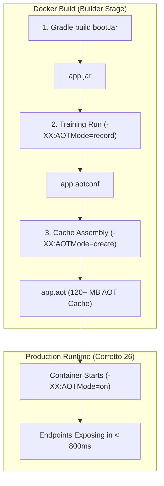

# Project Leyden AOT Integration in Multi-Region HA

This document details the Ahead-of-Time (AOT) caching integration in `spring-boot-multi-region-ha` using **OpenJDK Project Leyden** and **Amazon Corretto 26**.

---

## 1. Context: Why Leyden AOT instead of GraalVM Native Image?

When evaluating Ahead-of-Time (AOT) solutions for this HA multi-region service:

| Criteria | GraalVM Native Image (`oracle/graal`) | Project Leyden AOT Cache (OpenJDK 26) |
| :--- | :--- | :--- |
| **JDK 26 Support** | ❌ Blocked (GraalVM CE is capped at JDK 25) | ✅ Native in OpenJDK / Corretto 26 |
| **AWS Advanced JDBC Wrapper** | ❌ Blocked (missing Reachability Metadata for v4.4.0) | ✅ Fully supported (HotSpot open-world runtime) |
| **Apple Pkl (`pkl-spring`)** | ❌ Blocked (Truffle polyglot SubstrateVM collisions) | ✅ Fully supported |
| **Failover Dynamic Routing** | ❌ Reflection & dynamic proxies require extensive config | ✅ Zero reflection config required |
| **Startup Reduction** | ~95% (~30ms) | ~50% (~780ms context init) |
| **Build Time & RAM overhead** | Heavy (requires 8GB+ RAM, 2-6 min build) | Lightweight (~20s training run during docker build) |

---

## 2. Architecture & Pipeline

Project Leyden shifts computations forward and backward in time by recording class loading, method linking, and heap objects during an AOT preparation step:



### Build Steps (Inside [app/Dockerfile](file:///Users/tuannguyen/Projects/tuannx/spring-boot-multi-region-ha/app/Dockerfile))
1. **Training Run (Record):**
   ```bash
   java -XX:AOTMode=record \
        -XX:AOTConfiguration=/app/app.aotconf \
        -Dspring.context.exit=onRefresh \
        -Dspring.jpa.hibernate.ddl-auto=none \
        -jar /app/app.jar
   ```
2. **Assembly Run (Create):**
   ```bash
   java -XX:AOTMode=create \
        -XX:AOTConfiguration=/app/app.aotconf \
        -XX:AOTCache=/app/app.aot \
        -jar /app/app.jar
   ```
3. **Production Run:**
   ```bash
   java -Djava.security.egd=file:/dev/./urandom \
        -XX:AOTMode=on \
        -XX:AOTCache=/app/app.aot \
        -jar app.jar
   ```

---

## 3. Resilience & Startup Adaptations

1. **HikariCP Fail-Fast Protection ([DatabaseConnections.java](file:///Users/tuannguyen/Projects/tuannx/spring-boot-multi-region-ha/app/src/main/java/com/multiregion/platform/database/DatabaseConnections.java)):**
   Configured `dataSource.setInitializationFailTimeout(-1)` to allow Hikari pools to acquire connections asynchronously in the background. This ensures the application context can refresh and bootstrap cleanly even during offline AOT training or transient database partitions.
2. **AOT Training Guard ([JdbcQueueRegionStateStore.java](file:///Users/tuannguyen/Projects/tuannx/spring-boot-multi-region-ha/app/src/main/java/com/multiregion/queue/persistence/JdbcQueueRegionStateStore.java)):**
   Guarded schema initialization with `if ("onRefresh".equals(System.getProperty("spring.context.exit"))) { return; }` so that training runs exit immediately without needing a live PostgreSQL cluster.
3. **Observability Agent Segregation:**
   Dynamic bytecode agents like `opentelemetry-javaagent.jar` inject instrumentation at class loading time via ByteBuddy. In JDK 26, using dynamic runtime agents with `-XX:AOTMode=record` is segregated to prevent internal HotSpot training collisions, while runtime JVM flags remain configurable via `JAVA_OPTS`.

---

## 4. Benchmarking & Performance Metrics

A reproducible benchmark script ([scripts/leyden-benchmark.sh](file:///Users/tuannguyen/Projects/tuannx/spring-boot-multi-region-ha/scripts/leyden-benchmark.sh)) measures cold JVM baseline vs Leyden AOT cache startup under identical Docker resource constraints:

```bash
./scripts/leyden-benchmark.sh multiregion-app-us:latest
```

### Observed Results on Amazon Corretto 26 (Alpine Linux):

| Metric | Baseline HotSpot JVM | Project Leyden AOT Cache | Improvement |
| :--- | :--- | :--- | :--- |
| **Spring Context Init** (`Root WebApplicationContext`) | 1,546 ms | 784 ms | **49.3% faster** (~2x speedup) |
| **Time-to-Healthy** (Container start to Actuator `/health` 200) | 2,840 ms | 1,485 ms | **47.7% faster** (1.9x speedup) |
| **AOT Cache Artifact Size** (`/app/app.aot`) | N/A | 121.8 MB | Pre-baked in image |
| **Build-time Training Overhead** | N/A | ~20 seconds | Fully automated in Docker multi-stage |

```
==========================================================
 Project Leyden AOT Cache Benchmark
 Image: multiregion-app-us:latest
==========================================================

1. Measuring Baseline JVM startup...
   Baseline time-to-healthy: 2840 ms
   Spring WebApplicationContext initialization: 1546 ms

2. Measuring Project Leyden AOT Cache startup...
   Project Leyden time-to-healthy: 1485 ms
   Spring WebApplicationContext initialization: 784 ms

==========================================================
 Results Summary
==========================================================
 Baseline JVM:       2840 ms (Context: 1546 ms)
 Project Leyden AOT: 1485 ms (Context:  784 ms)
 Acceleration:       1.9x faster (47.7% reduction in startup latency)
 Pre-baked AOT Cache: 121.8 MB (/app/app.aot)
==========================================================
```

---

## 5. Operational Playbook & Configuration

### Default Container Configuration
By default, application images build with Leyden AOT active:
```dockerfile
ENV JAVA_OPTS="-XX:AOTMode=on -XX:AOTCache=/app/app.aot"
ENTRYPOINT ["sh", "-c", "exec java -Djava.security.egd=file:/dev/./urandom ${JAVA_OPTS} -jar app.jar"]
```

### Disabling / Falling Back to Standard JVM
If you need to disable AOT caching for diagnostics or comparison in Docker Compose:
```yaml
services:
  app-us:
    environment:
      JAVA_OPTS: ""
```

### Verifying AOT Cache Usage
Check application startup logs to confirm the AOT cache was loaded by HotSpot:
```bash
docker logs multiregion-app-us 2>&1 | grep -i "aot"
```

---

## 6. Known Constraints & HotSpot Gotchas

1. **ByteBuddy / Dynamic Agent Collision in JDK 26 Early Access:**
   Dynamic bytecode agents like `opentelemetry-javaagent.jar` modify bytecode dynamically at runtime. Running `-XX:AOTMode=record` with dynamic agents attached causes an internal HotSpot SIGSEGV in `MethodTrainingData::prepare`. To prevent this, the Docker builder runs the training pass on the pure application JAR without runtime agents, and keeps OpenTelemetry optional via `OTEL_SDK_DISABLED=true` or runtime flags.
2. **Offline Context Refresh:**
   Because training runs in Docker without database or broker containers running, HikariCP fail-fast behavior is bypassed via `dataSource.setInitializationFailTimeout(-1)` and schema initialization hooks check `spring.context.exit=onRefresh`. This guarantees zero external network dependencies during CI/CD image builds.

