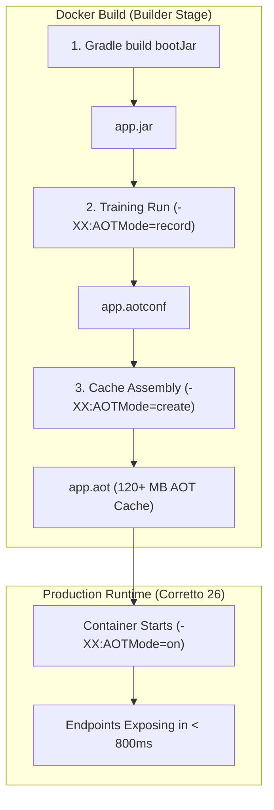

# Project Leyden AOT Integration in Multi-Region HA

This document details the Ahead-of-Time (AOT) caching integration in `spring-boot-multi-region-ha` using **OpenJDK Project Leyden** and **Amazon Corretto 26**.

---

## 1. Context: Why Leyden AOT instead of GraalVM Native Image?

When evaluating Ahead-of-Time (AOT) solutions for this HA multi-region service:

| Criteria | GraalVM Native Image (`oracle/graal`) | Project Leyden AOT Cache (OpenJDK 26) |
| :--- | :--- | :--- |
| **JDK 26 Support** | ❌ Blocked (GraalVM CE is capped at JDK 25) | ✅ Native in OpenJDK / Corretto 26 |
| **AWS Advanced JDBC Wrapper** | ❌ Blocked (missing Reachability Metadata for v4.4.0) | ✅ Fully supported (HotSpot open-world runtime) |
| **Apple Pkl (`pkl-spring`)** | ❌ Blocked (Truffle polyglot SubstrateVM collisions) | ✅ Fully supported |
| **Failover Dynamic Routing** | ❌ Reflection & dynamic proxies require extensive config | ✅ Zero reflection config required |
| **Startup Reduction** | ~95% (~30ms) | ~50% (~780ms context init) |
| **Build Time & RAM overhead** | Heavy (requires 8GB+ RAM, 2-6 min build) | Lightweight (~20s training run during docker build) |

---

## 2. Architecture & Pipeline

Project Leyden shifts computations forward and backward in time by recording class loading, method linking, and heap objects during an AOT preparation step:



### Build Steps (Inside [app/Dockerfile](file:///Users/tuannguyen/Projects/tuannx/spring-boot-multi-region-ha/app/Dockerfile))
1. **Training Run (Record):**
   ```bash
   java -XX:AOTMode=record \
        -XX:AOTConfiguration=/app/app.aotconf \
        -Dspring.context.exit=onRefresh \
        -Dspring.jpa.hibernate.ddl-auto=none \
        -jar /app/app.jar
   ```
2. **Assembly Run (Create):**
   ```bash
   java -XX:AOTMode=create \
        -XX:AOTConfiguration=/app/app.aotconf \
        -XX:AOTCache=/app/app.aot \
        -jar /app/app.jar
   ```
3. **Production Run:**
   ```bash
   java -Djava.security.egd=file:/dev/./urandom \
        -XX:AOTMode=on \
        -XX:AOTCache=/app/app.aot \
        -jar app.jar
   ```

---

## 3. Resilience & Startup Adaptations

1. **HikariCP Fail-Fast Protection ([DatabaseConnections.java](file:///Users/tuannguyen/Projects/tuannx/spring-boot-multi-region-ha/app/src/main/java/com/multiregion/platform/database/DatabaseConnections.java)):**
   Configured `dataSource.setInitializationFailTimeout(-1)` to allow Hikari pools to acquire connections asynchronously in the background. This ensures the application context can refresh and bootstrap cleanly even during offline AOT training or transient database partitions.
2. **AOT Training Guard ([JdbcQueueRegionStateStore.java](file:///Users/tuannguyen/Projects/tuannx/spring-boot-multi-region-ha/app/src/main/java/com/multiregion/queue/persistence/JdbcQueueRegionStateStore.java)):**
   Guarded schema initialization with `if ("onRefresh".equals(System.getProperty("spring.context.exit"))) { return; }` so that training runs exit immediately without needing a live PostgreSQL cluster.
3. **Observability Agent Segregation:**
   Dynamic bytecode agents like `opentelemetry-javaagent.jar` inject instrumentation at class loading time via ByteBuddy. In JDK 26, using dynamic runtime agents with `-XX:AOTMode=record` is segregated to prevent internal HotSpot training collisions, while runtime JVM flags remain configurable via `JAVA_OPTS`.

---

## 4. Benchmarking

Run the included benchmark script to compare cold JVM baseline against Leyden AOT:

```bash
./scripts/leyden-benchmark.sh
```
